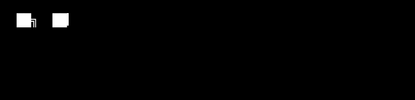

### `FULL STACK • ROBOTICS • APPLIED AI`

 

&nbsp;&nbsp;&nbsp;
&nbsp;&nbsp;&nbsp;

## `> Languages & Tools`

---

## `> featured`

<table>
<tr>

<td width="50%" align="center">

<h3>💬 Speakify</h3>

<b>Real-time chat platform</b>

 

 

</td>

</tr>
</table>
